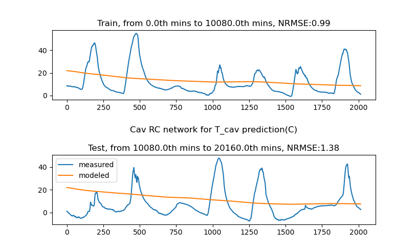
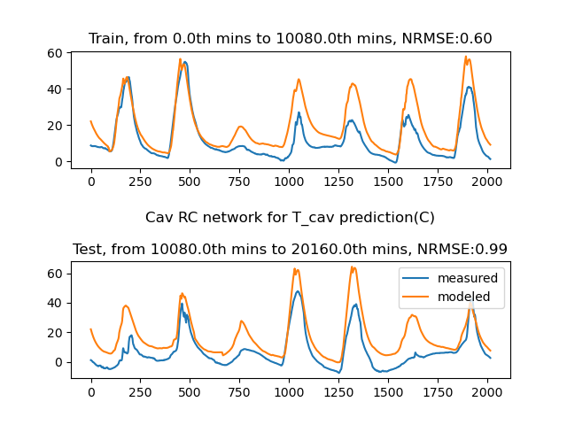

# Integrated RC network


$$
C_{cav}\frac{dT_{cav}}{dt} = \frac{T_{out} - T_{cav}}{R_{out, cav}} + \frac{T_{room} - T_{cav}}{R_{cav, room}} + \dot{Q}_{sol, cav}\\
C_{room}\frac{dT_{room}}{dt} = \frac{T_{out} - T_{room}}{R_{out, room}} + \frac{T_{sur} - T_{room}}{R_{room, sur}} + \frac{T_{cav} - T_{room}}{R_{cav, room}} + \dot{Q}_{sol, room} + \dot{Q}_{int, room}\\
C_{sur}\frac{dT_{sur}}{dt} = \frac{T_{room} - T_{sur}}{R_{room, sur}} + \frac{T_{so} - T_{sur}}{R_{sur, so}}+ \dot{Q}_{sol, sur} + \dot{Q}_{int, sur}\\
C_{so}\frac{dT_{so}}{dt} = \frac{T_{sur} - T_{so}}{R_{sur, so}} + \frac{T_{si} - T_{so}}{R_{si, so}}\\
C_{si}\frac{dT_{si}}{dt} = \frac{T_{so} - T_{si}}{R_{so, si}}
$$

$$
x^T = [T_{cav}, T_{room}, T_{sur}, T_{so}, T_{si}]\\
u^T = [T_{out}, \dot{Q}_{sol, cav}, \dot{Q}_{sol, room}, \dot{Q}_{int, room}, \dot{Q}_{sol, sur}, \dot{Q}_{int, sur}, \frac{dT_{so}}{dt}]\\
y = \dot{Q}_{rslab} = \frac{T_{sur} - T_{so}}{R_{sur, so}} + \frac{T_{si} - T_{so}}{R_{si, so}} - C_{so}\frac{dT_{so}}{dt} \\
$$

$$
\begin{bmatrix}
    \frac{dT_{cav}}{dt} \\\frac{dT_{room}}{dt} \\\frac{dT_{sur}}{dt} \\\frac{dT_{so}}{dt} \\\frac{dT_{si}}{dt}
\end{bmatrix}
=
\begin{bmatrix}
(\frac{-1}{R_{out, cav}C_{cav}} + \frac{-1}{R_{cav, room}C_{cav}}) ,   \frac{1}{R_{cav, room}C_{cav}} ,0 , 0 , 0 \\
\frac{1}{R_{cav, room}C_{room}} ,  ( \frac{-1}{R_{out, room}C_{room}} + \frac{-1}{R_{room, sur}C_{room}} + \frac{-1}{R_{cav, room}C_{room}} ), \frac{1}{R_{room, sur}C_{room}} , 0 , 0 \\
0 ,   \frac{1}{R_{room, sur}C_{sur}} , (\frac{-1}{R_{room, sur}C_{sur}} + \frac{-1}{R_{sur, so}C_{sur}}),\frac{1}{R_{sur, so}C_{sur}} , 0 \\
0 ,  0 ,  \frac{1}{R_{sur, so}C_{so}},(\frac{-1}{R_{sur, so}C_{so}} + \frac{-1}{R_{si, so}C_{so} }) , \frac{1}{R_{si, so}C_{so} } \\
0 , 0 , 0 , \frac{1} {R_{so, si}C_{si}} , \frac{-1}{R_{so, si}C_{si}}
\end{bmatrix}
\begin{bmatrix}
	T_{cav}\\T_{room} \\ T_{sur}\\T_{so}\\T_{si}
\end{bmatrix}
+
\begin{bmatrix}
\frac{1}{R_{out, cav}C_{cav}}  , 1 ,0 , 0 ,0 , 0 , 0\\
\frac{1}{R_{out, room}C_{room}}  , 0 , 1 , 1 ,0 , 0 , 0\\
0 , 0 , 0 , 0 ,1 , 1 , 0\\
0 , 0 , 0 , 0 ,0 , 0 , 0\\
0 , 0 , 0 , 0 ,0 , 0 , 0
\end{bmatrix}
\begin{bmatrix}
	T_{out}\\ \dot{Q}_{sol, cav}\\ \dot{Q}_{sol, room}\\ \dot{Q}_{int, room}\\ \dot{Q}_{sol, sur}\\ \dot{Q}_{int, sur}\\ \frac{dT_{so}}{dt}
\end{bmatrix}
$$

$$
y = \dot{Q}_{rslab} =
\begin{bmatrix}
0 & 0 & \frac{1}{R_{sur, so}} & (\frac{-1}{R_{sur, so}} + \frac{-1}{R_{si, so}}) & \frac{1}{R_{si, so}}
\end{bmatrix}
\begin{bmatrix}
	T_{cav}\\T_{room} \\ T_{sur}\\T_{so}\\T_{si}
\end{bmatrix}
+
\begin{bmatrix}
0&0&0&0&0&0& -C_{so}
\end{bmatrix}
\begin{bmatrix}
	T_{out}\\ \dot{Q}_{sol, cav}\\ \dot{Q}_{sol, room}\\ \dot{Q}_{int, room}\\ \dot{Q}_{sol, sur}\\ \dot{Q}_{int, sur}\\ \frac{dT_{so}}{dt}
\end{bmatrix}
$$

$$
A = 
\begin{bmatrix}
(\frac{-1}{R_{out, cav}C_{cav}} + \frac{-1}{R_{cav, room}C_{cav}}) &   \frac{1}{R_{cav, room}C_{cav}} & 0 & 0 & 0 \\
\frac{1}{R_{cav, room}C_{room}} &  ( \frac{-1}{R_{out, room}C_{room}} + \frac{-1}{R_{room, sur}C_{room}} + \frac{-1}{R_{cav, room}C_{room}} )& \frac{1}{R_{room, sur}C_{room}} & 0 & 0 \\
0 &   \frac{1}{R_{room, sur}C_{sur}} &  (\frac{-1}{R_{room, sur}C_{sur}} + \frac{-1}{R_{sur, so}C_{sur}})&\frac{1}{R_{sur, so}C_{sur}} & 0 \\
0 &  0 &  \frac{1}{R_{sur, so}C_{so}}&(\frac{-1}{R_{sur, so}C_{so}} + \frac{-1}{R_{si, so}C_{so} }) &  \frac{1}{R_{si, so}C_{so} } \\
0 & 0 & 0 &\frac{1} {R_{so, si}C_{si}}  & \frac{-1}{R_{so, si}C_{si}}
\end{bmatrix}
\\
B = 
\begin{bmatrix}
\frac{1}{R_{out, cav}C_{cav}}  & 1 & 0 & 0 &0 & 0 & 0\\
\frac{1}{R_{out, room}C_{room}}  & 0 & 1 & 1 &0 & 0 & 0\\
0 & 0 & 0 & 0 &1 & 1 & 0\\
0 & 0 & 0 & 0 &0 & 0 & 0\\
0 & 0 & 0 & 0 &0 & 0 & 0
\end{bmatrix}
\\
c = 
\begin{bmatrix}
0 & 0 & \frac{1}{R_{sur, so}} & (\frac{-1}{R_{sur, so}} + \frac{-1}{R_{si, so}}) & \frac{1}{R_{si, so}}
\end{bmatrix}
\\
d = 
\begin{bmatrix}
0&0&0&0&0&0& -C_{so}
\end{bmatrix}
$$

parameter initial values:

1. r out cav, 0.036 K/W
2. r cav room, 0.0036 K/W
3. r out room, 0.036 K/W
4. r room sur, 10 K/W
5. r sur so, 40 K/W
6. r si so, 300 K/W
7. c cav,  (air 75300 j/k)
8. c room, (air 376500 J/K)
9. c sur (concrete, 2E7 J/K)
10. c so (water, 2629 J/K)
11. c si (common insulation material 3360000 J/K)

# Cav RC


$$
C_{cav}\frac{dT_{cav}}{dt} = \frac{T_{out} - T_{cav}}{R_{out, cav}} + \frac{T_{room} - T_{cav}}{R_{cav, room}} + \alpha_{sol, cav}\dot{Q}_{sol, cav}\\
x^T = [T_{cav}, \alpha_{sol, cav}]\\
u^T = [T_{out},T_{room}, \dot{Q}_{sol}]\\
y = T_{cav}\\
$$

$$
\begin{bmatrix}
\frac{dT_{cav}}{dt} 
\end{bmatrix}
=
\begin{bmatrix}
(\frac{-1}{R_{out, cav}C_{cav}} + \frac{-1}{R_{cav, room}C_{cav}}) 
\end{bmatrix}
\begin{bmatrix}
T_{cav} 
\end{bmatrix}
+
\begin{bmatrix}
\frac{1}{R_{room, cav}C_{cav}}, \frac{1}{R_{out, cav}C_{cav}}, \alpha_{sol, cav}
\end{bmatrix}
\begin{bmatrix}
T_{room} \\
T_{out}\\
\dot{Q}_{sol, cav}
\end{bmatrix}
$$

$$
y = T_{cav} = [1] [T_{cav}]  + [0,0,0]
\begin{bmatrix}
T_{room} \\
T_{out}\\
\dot{Q}_{sol, cav}
\end{bmatrix}
$$

## initial guessing

p[0] = r out cav, K/W, 1 / 51.92 = 0.019

p[1] = r cav room, K/W, 1/29.07 = 0.034

p[2] = c cav, K/W, 1 / 1.13e-6 = 885000

p[3] = alpha sol cav, -, 1

```python
r out cav, r cav room, c cav, alpha sol cav
initial error, best_cost=1.75e+5
0.019,0.034,885000,1 #calculated
0.019,0.034,885000,2E-5 #trivial and errors
```




