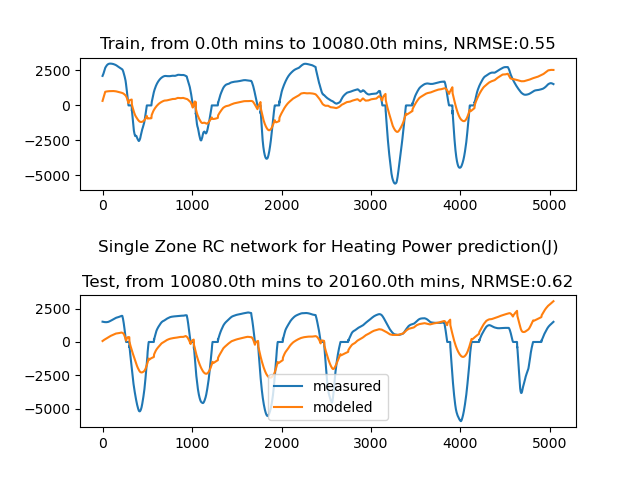
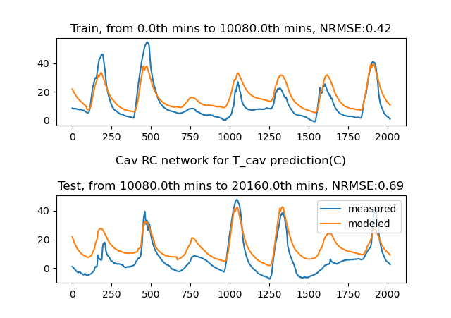
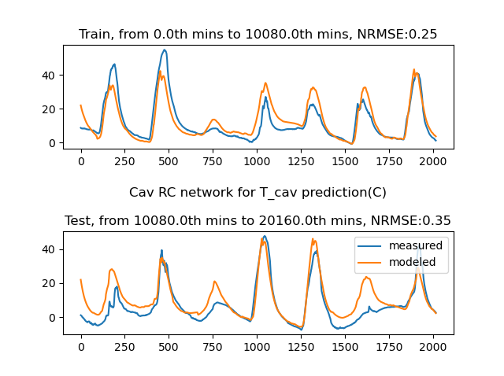
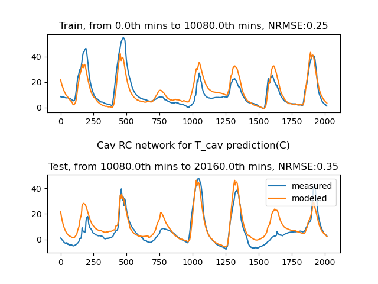
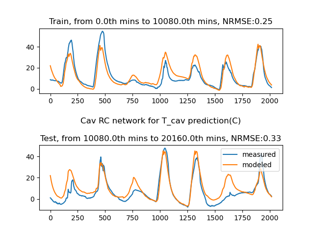

# Arguments used for RC network

## single zone

-a 120 0 5040 7 12 22 10 10 -1 0

## cav

-a 300 0 2016 1 3 4 500 100 0 0

## Radiant Slab

-a 300 0 2016 3 4 8 500 100 2 0 

## integrated rc

-a 300 0 2016 5 7 11 500 100 3 0

# Single Zone log



# Integrated RC network


$$
C_{cav}\frac{dT_{cav}}{dt} = \frac{T_{out} - T_{cav}}{R_{out, cav}} + \frac{T_{room} - T_{cav}}{R_{cav, room}} + \dot{Q}_{sol, cav}\\
C_{room}\frac{dT_{room}}{dt} = \frac{T_{out} - T_{room}}{R_{out, room}} + \frac{T_{sur} - T_{room}}{R_{room, sur}} + \frac{T_{cav} - T_{room}}{R_{cav, room}} + \dot{Q}_{sol, room} + \dot{Q}_{int, room}\\
C_{sur}\frac{dT_{sur}}{dt} = \frac{T_{room} - T_{sur}}{R_{room, sur}} + \frac{T_{so} - T_{sur}}{R_{sur, so}}+ \dot{Q}_{sol, sur} + \dot{Q}_{int, sur}\\
C_{so}\frac{dT_{so}}{dt} = \frac{T_{sur} - T_{so}}{R_{sur, so}} + \frac{T_{si} - T_{so}}{R_{si, so}}\\
C_{si}\frac{dT_{si}}{dt} = \frac{T_{so} - T_{si}}{R_{so, si}}
$$

$$
x^T = [T_{cav}, T_{room}, T_{sur}, T_{so}, T_{si}]\\
u^T = [T_{out}, \dot{Q}_{sol, cav}, \dot{Q}_{sol, room}, \dot{Q}_{int, room}, \dot{Q}_{sol, sur}, \dot{Q}_{int, sur}, \frac{dT_{so}}{dt}]\\
y = \dot{Q}_{rslab} = \frac{T_{sur} - T_{so}}{R_{sur, so}} + \frac{T_{si} - T_{so}}{R_{si, so}} - C_{so}\frac{dT_{so}}{dt} \\
$$

$$
\begin{bmatrix}
    \frac{dT_{cav}}{dt} \\\frac{dT_{room}}{dt} \\\frac{dT_{sur}}{dt} \\\frac{dT_{so}}{dt} \\\frac{dT_{si}}{dt}
\end{bmatrix}
=
\begin{bmatrix}
(\frac{-1}{R_{out, cav}C_{cav}} + \frac{-1}{R_{cav, room}C_{cav}}) ,   \frac{1}{R_{cav, room}C_{cav}} ,0 , 0 , 0 \\
\frac{1}{R_{cav, room}C_{room}} ,  ( \frac{-1}{R_{out, room}C_{room}} + \frac{-1}{R_{room, sur}C_{room}} + \frac{-1}{R_{cav, room}C_{room}} ), \frac{1}{R_{room, sur}C_{room}} , 0 , 0 \\
0 ,   \frac{1}{R_{room, sur}C_{sur}} , (\frac{-1}{R_{room, sur}C_{sur}} + \frac{-1}{R_{sur, so}C_{sur}}),\frac{1}{R_{sur, so}C_{sur}} , 0 \\
0 ,  0 ,  \frac{1}{R_{sur, so}C_{so}},(\frac{-1}{R_{sur, so}C_{so}} + \frac{-1}{R_{si, so}C_{so} }) , \frac{1}{R_{si, so}C_{so} } \\
0 , 0 , 0 , \frac{1} {R_{so, si}C_{si}} , \frac{-1}{R_{so, si}C_{si}}
\end{bmatrix}
\begin{bmatrix}
	T_{cav}\\T_{room} \\ T_{sur}\\T_{so}\\T_{si}
\end{bmatrix}
+
\begin{bmatrix}
\frac{1}{R_{out, cav}C_{cav}}  , 1 ,0 , 0 ,0 , 0 , 0\\
\frac{1}{R_{out, room}C_{room}}  , 0 , 1 , 1 ,0 , 0 , 0\\
0 , 0 , 0 , 0 ,1 , 1 , 0\\
0 , 0 , 0 , 0 ,0 , 0 , 0\\
0 , 0 , 0 , 0 ,0 , 0 , 0
\end{bmatrix}
\begin{bmatrix}
	T_{out}\\ \dot{Q}_{sol, cav}\\ \dot{Q}_{sol, room}\\ \dot{Q}_{int, room}\\ \dot{Q}_{sol, sur}\\ \dot{Q}_{int, sur}\\ \frac{dT_{so}}{dt}
\end{bmatrix}
$$

$$
y = \dot{Q}_{rslab} =
\begin{bmatrix}
0 & 0 & \frac{1}{R_{sur, so}} & (\frac{-1}{R_{sur, so}} + \frac{-1}{R_{si, so}}) & \frac{1}{R_{si, so}}
\end{bmatrix}
\begin{bmatrix}
	T_{cav}\\T_{room} \\ T_{sur}\\T_{so}\\T_{si}
\end{bmatrix}
+
\begin{bmatrix}
0&0&0&0&0&0& -C_{so}
\end{bmatrix}
\begin{bmatrix}
	T_{out}\\ \dot{Q}_{sol, cav}\\ \dot{Q}_{sol, room}\\ \dot{Q}_{int, room}\\ \dot{Q}_{sol, sur}\\ \dot{Q}_{int, sur}\\ \frac{dT_{so}}{dt}
\end{bmatrix}
$$

$$
A = 
\begin{bmatrix}
(\frac{-1}{R_{out, cav}C_{cav}} + \frac{-1}{R_{cav, room}C_{cav}}) &   \frac{1}{R_{cav, room}C_{cav}} & 0 & 0 & 0 \\
\frac{1}{R_{cav, room}C_{room}} &  ( \frac{-1}{R_{out, room}C_{room}} + \frac{-1}{R_{room, sur}C_{room}} + \frac{-1}{R_{cav, room}C_{room}} )& \frac{1}{R_{room, sur}C_{room}} & 0 & 0 \\
0 &   \frac{1}{R_{room, sur}C_{sur}} &  (\frac{-1}{R_{room, sur}C_{sur}} + \frac{-1}{R_{sur, so}C_{sur}})&\frac{1}{R_{sur, so}C_{sur}} & 0 \\
0 &  0 &  \frac{1}{R_{sur, so}C_{so}}&(\frac{-1}{R_{sur, so}C_{so}} + \frac{-1}{R_{si, so}C_{so} }) &  \frac{1}{R_{si, so}C_{so} } \\
0 & 0 & 0 &\frac{1} {R_{so, si}C_{si}}  & \frac{-1}{R_{so, si}C_{si}}
\end{bmatrix}
\\
B = 
\begin{bmatrix}
\frac{1}{R_{out, cav}C_{cav}}  & 1 & 0 & 0 &0 & 0 & 0\\
\frac{1}{R_{out, room}C_{room}}  & 0 & 1 & 1 &0 & 0 & 0\\
0 & 0 & 0 & 0 &1 & 1 & 0\\
0 & 0 & 0 & 0 &0 & 0 & 0\\
0 & 0 & 0 & 0 &0 & 0 & 0
\end{bmatrix}
\\
c = 
\begin{bmatrix}
0 & 0 & \frac{1}{R_{sur, so}} & (\frac{-1}{R_{sur, so}} + \frac{-1}{R_{si, so}}) & \frac{1}{R_{si, so}}
\end{bmatrix}
\\
d = 
\begin{bmatrix}
0&0&0&0&0&0& -C_{so}
\end{bmatrix}
$$

parameter initial values:

1. r out cav, 0.036 K/W
2. r cav room, 0.0036 K/W
3. r out room, 0.036 K/W
4. r room sur, 10 K/W
5. r sur so, 40 K/W
6. r si so, 300 K/W
7. c cav,  (air 75300 j/k)
8. c room, (air 376500 J/K)
9. c sur (concrete, 2E7 J/K)
10. c so (water, 2629 J/K)
11. c si (common insulation material 3360000 J/K)

## Initial guessing

| 3.60E-02 | 3.60E-03 | 3.60E-02 | 1.00E+01 | 4.00E+01 | 3.00E+02 |
| -------- | -------- | -------- | -------- | -------- | -------- |
| 9.00E-01 | 1.413    | 8.70E-01 | 1.14E+01 | 4.17E+01 | 3.00E+02 |
| 5.67     | 8.24     | 9.63     | 1.57E+01 | 3.92E+01 | 2.94E+02 |
| 0.019    | 0.034    | 0.046    | 1.89E-03 | 7.00E-04 | 4.00E-03 |

```matlab
3.60E-02	3.60E-03	3.60E-02	1.00E+01	4.00E+01	3.00E+02	7.53E+04	3.77E+05	2.00E+07	2.63E+03	3.36E+06		5.37E+03
9.00E-01	1.413	8.70E-01	1.14E+01	4.17E+01	3.00E+02	7.53E+04	3.77E+05	2.00E+07	2.63E+03	3.36E+06		
5.67	8.24	9.63	1.57E+01	3.92E+01	2.94E+02	7.53E+04	3.77E+05	2.00E+07	2.63E+03	3.36E+06		
0.019	0.034	0.046	1.89E-03	7.00E-04	4.00E-03	8.85E+05	4.12E+06	2.80E+07	2.70E+06	2.42E+16		Jaewan
```


# Cav RC


$$
C_{cav}\frac{dT_{cav}}{dt} = \frac{T_{out} - T_{cav}}{R_{out, cav}} + \frac{T_{room} - T_{cav}}{R_{cav, room}} + \alpha_{sol, cav}\dot{Q}_{sol}\\
x^T = [T_{cav}, \alpha_{sol, cav}]\\
u^T = [T_{out},T_{room}, \dot{Q}_{sol}]\\
y = T_{cav}\\
$$

$$
\begin{bmatrix}
\frac{dT_{cav}}{dt} 
\end{bmatrix}
=
\begin{bmatrix}
(\frac{-1}{R_{out, cav}C_{cav}} + \frac{-1}{R_{cav, room}C_{cav}}) 
\end{bmatrix}
\begin{bmatrix}
T_{cav} 
\end{bmatrix}
+
\begin{bmatrix}
\frac{1}{R_{room, cav}C_{cav}}, \frac{1}{R_{out, cav}C_{cav}},\frac{\alpha_{sol, cav}}{C_{cav}} 
\end{bmatrix}
\begin{bmatrix}
T_{room} \\
T_{out}\\
\dot{Q}_{sol}
\end{bmatrix}
$$

$$
y = T_{cav} = [1] [T_{cav}]  + [0,0,0]
\begin{bmatrix}
T_{room} \\
T_{out}\\
\dot{Q}_{sol}
\end{bmatrix}
$$

## initial guessing

p[0] = r out cav, K/W, 1 / 51.92 = 0.019

p[1] = r cav room, K/W, 1/29.07 = 0.034

p[2] = c cav, K/W, 1 / 1.13e-6 = 885000

p[3] = alpha sol cav, -, 1

```python
r out cav, r cav room, c cav, alpha sol cav
0.019,0.034,885000,0.04 #calculated， initial error, best_cost=3.46e+5
0.019,0.034,885000,2E-5 #trivial and errors
2.58782929e-02 3.73895712e-02 8.85000163e+05 1.10505928e-05 # 500 particle 50 iterations， best_cost=1.21e+5
0.015699672628408535,0.06957654569819255,885003.250092871,13.241131706237134 # 500 particle 200 iterations， best_cost=7.3e+4
```










## test multi-processes


| 前50个数据 | pos                                                          |      |      |
| ---------- | ------------------------------------------------------------ | ---- | ---- |
| 3进程并发  | 8.16505902e-04  1.94427052e-03  8.85000490e+05 -1.09815616e-01 | 16   |      |
| 单进程     | 2.02431304e-03 4.91892908e-03 8.85000045e+05 2.27941988e-01  | 29   |      |

# Slab RC Agent

| key           | value                                                        | error   |                     |
| ------------- | ------------------------------------------------------------ | ------- | ------------------- |
| initial guess | 1.9e-3,7e-4,4e-3,0.028e9,2.77e6,2.42e16,0.008,0.24           | 7.18e16 |                     |
| 500 100       | 1.1664071846897246, 2.1127175049843863, 1.0574083027893111e-07, 27999998.206885774, 2769999.8891689423, 2.42e+16, 0.21925012454675613, 1.0036951424345222 | 2.6e4   | 高频波动， 并且爆炸 |
|               | 3.565455621461035, 3.579061709857663, 3.6776554628534534e-08, 28000003.533421736, 2770001.285911508, 2.42e+16, 1.1935044634122434, 3.621610705363608 | 2.2e4   | 低频波动，并且爆炸  |
| re-guessing   | 0.0029, 7.29e-4, 3.6e-3, 2.8e7, 2.87e6, 2.16e11, 8e-3,5e-2   |         |                     |
|               | 0.7710936565188258, 0.010036437453163016, 0.0007809029048008766, 28000000.830190614, 2870000.914901932, 216000000000.24078, 0.6552671964669653, 0.9609597363638201 |         |                     |


## Debugged ABCD

|                         | POS                                                          | Error |              |
| ----------------------- | ------------------------------------------------------------ | ----- | ------------ |
| initial guess           | 1.9e-3,7e-4,4e-3,0.028e9,2.77e6,2.42e16,0.008,0.24           | 8.9e3 |              |
| 500 particles, 40 iters | -0.2869646540264104, 0.0500634047589224, 0.00459996565139692, 28000000.082831714, 2770000.6185414484, 2.42e+16, -0.35913206322395813, -1.3657262603277223 | 225   |              |
| re-guess                | 0.0029, 7.29e-4, 3.6e-3, 2.8e7, 2.87e6, 2.16e11, 8e-3,2.4e-1 | 8.9e3 |              |
| 500,40                  | 0.005208459367967246, 0.3981205902429597, 0.009325296368318886, 28000000.430961553, 2869999.707518955, 216000000000.29727, -0.34891730140816624, -0.4523627018804293 | 328   |              |
|                         | -0.5242606101298344, 0.0015698106341046625, 0.0011122128360621358, 27999999.672175623, 2869999.729085807, 215999999999.70892, -0.759907230887575, -0.9749083903820621 | 181   | best✅        |
| guess                   | 0.0029, 7.29e-4, 3.6e-3, 2.8e7, 2.87e6, 2.16e11, 8e-3,5e-2   |       |              |
|                         | 0.005937463849897054, 0.5576652946719106, 0.014700477415882162, 28000000.263072465, 2870000.0012960625, 216000000001.08105, -0.07753017804998136, -0.5140548004696344 |       |              |
| guess                   | 0.0029, 7.29e-4, 3.6e-3, 2.8e7, 2.87e6, 2.16e11, 8e-3,2.4e-1 | 8.9e3 | best guess ✅ |
|                         | -0.012180768108003425, 0.0007736609103841854, 0.0008596463602503905, 28000000.756969254, 2870000.1240682025, 216000000000.067, -0.09541445290720726, -0.6682615430353211 | 32    | best✅✅       |


# Room RC

-a 300 0 2016 2 7 11 6 9 1 0

-a 300 0 2016 1 3 4 6 9 0 0

| 2                                                            | 3                                                            |      |
| ------------------------------------------------------------ | ------------------------------------------------------------ | ---- |
|  | p[0] = 1/ 123.9 = 8.06e-3, p[1] = 1/34.4 = 2.9e-2, p2 = 1 / 72.87 = 0.014, p3 = 1 / 679.76 = 1.47e-3,p4 = 1 / 8.73e-8=11.9e6, p5 = 1/1.97e-7 = 5e6, p6 = 1, p7 = 1, p8 = 1, p9 = 1 |      |
|                                                              | 8.06e-3, 2.9e-2,0.014,1.47e-3,11.9e6,5e6,1,1,1,1             |      |

# Room without sink node

|          | paras                                                        | error   | CVRMSE             | MAE                |
| -------- | ------------------------------------------------------------ | ------- | ------------------ | ------------------ |
| initial  | 3.32e-3,6e-2,6e-2,6e-2,2e-3,2e-2,6e5, 3e5, 1e8, 4e5, 1e3, 1e-8, 1e0, 1e0, 1e0, 1e-8, 1e0,1e0, 0.288e8 | 1.68e11 |                    |                    |
|          | 1.5328989859188904,4.573210475104306,4.982207715753423,7.748630994905065,0.006566615625008783,5.07002523411576,600001.9550356304,300002.2315303275,100000004.11450823,400005.2874105107,1000.1303557583077,-1.0024269954545824,4.5294226379176115,6.547733450809201,-0.36152792363228986,1.207408485983541,5.2554896926003325,7.182150827279619,28800008.789259482 |         | 7629.25<br>7629.25 | 4762.42<br>4762.42 |
| modified | 1.5328989859188904,4.573210475104306,4.982207715753423,7.748630994905065,0.006566615625008783,5.07002523411576,26e5,13e5,100000004.11450823,1.2e6,1000.1303557583077,-1.0024269954545824,4.5294226379176115,6.547733450809201,-0.36152792363228986,1.207408485983541,5.2554896926003325,7.182150827279619,28800008.789259482 |         |                    |                    |
|          |                                                              |         |                    |                    |


# Room with sink as state

|                               | paras                                                        | error   | CVRMSE             | MAE                | MAPE        |
| ----------------------------- | ------------------------------------------------------------ | ------- | ------------------ | ------------------ | ----------- |
| initial                       | 3.32e-3,6e-2,6e-2,6e-2,2e-3,2e-2,3.64e-4,3.64e-4,3.6e-3,6e5, 3e5, 1e8, 4e5,2.88e7,2e11,1.5e6,1e2, 1e-2, 1e0, 1e0, 1e0, 1e-8, 1e0,1e0 | 8.95e10 |                    |                    |             |
| 500,100                       | 0.5084072498104976, 0.22881938185802284, -0.1792689137468451, -0.28831550184443905, -0.06932762855299672, 0.12963310600376773, 0.23326646337040524, 0.0007729625753356434, 0.0019644511824371824, 600000.3420128205, 300000.0727317703, 100000000.11975306, 400000.1629334854, 28800000.415735282, 200000000000.0012, 1500000.0853379692, 100.26868487606403, 0.4845728183690306, 0.8905691616489486, 1.2376507186660821, 1.176320692113032, 0.03764009877828934, 1.054040244985077, 1.1283653822278548 | 4.86e10 |                    |                    |             |
| initial 2                     | 3.32e-3,6e-2,6e-2,6e-2,2e-3,2e-2,3.64e-4,3.64e-4,3.6e-3,26e5, 13e5, 1e8, 1.2e6,2.88e7,2e11,1.5e6,1e2, 1e-2, 1e0, 1e0, 1e0, 1e-8, 1e0,1e0 | 8.95e10 |                    |                    |             |
| 1000, 150                     | -0.04885115449859322, 0.27709437737961773, 0.2842438796476511, 0.2370433204866855, 2.5028857500738853, 1.2351101673187315, 0.0005581239817387717, 0.0005568426288265417, 0.4185212823262079, 2600000.9655292523, 1300000.7466202732, 100000000.33012688, 1200001.3058437894, 28799999.962735593, 200000000000.53522, 1500000.9601382674, 100.51803788376579, 0.7647327381531299, 1.0321803012234374, 1.7947498168498364, 0.35523725344749624, 0.5192690727905503, 1.5700068766915243, 1.721556950290277 | 4.85e10 | 5587.97            | 3341.60            |             |
| initial 3                     | 3.32e-3,6e-2,6e-2,6e-2,2e-3,2e-2,3.64e-4,3.64e-4,3.6e-3,26e5, 13e5, 1e8, 1.2e6,2.88e7,2e11,1.5e6,1e2, 1e-2, 1e0, 1e0, 1e0, 1e-8, 1e0,1e0 | 8.95e10 | 13182.32           | 6369.49            |             |
| from first 2 weeks, 1000, 150 | 0.3324629027999106,0.5024062417224047,0.9847923435147052,0.04646342327062378,0.6939377791918497,0.4891552195646157,0.0014054220001300127,0.0006658366836431561,0.004818999817034675,2600000.3907374367,1300000.4762113143,100000000.73959808,1200000.229568284,28800000.777467526,200000000000.39597,1500000.1564518127,100.19244360672805,0.21388159274114185,1.5398177449984547,2.4934716470713654,1.3700105719407651,0.46360322430636447,1.052647370006412,1.811847417431375 |         | 5518.42<br>5982.26 | 3203.69<br>3417.32 |             |
| carry on                      | 0.3324629027999106,0.5024062417224047,0.9847923435147052,0.04646342327062378,0.6939377791918497,0.4891552195646157,0.0014054220001300127,0.0006658366836431561,0.004818999817034675,2600000.3907374367,1300000.4762113143,100000000.73959808,1.2e6,0.82e7,2e4,5e5,100.19244360672805,0.21388159274114185,1.5398177449984547,2.4934716470713654,1.3700105719407651,0.46360322430636447,1.052647370006412,1.811847417431375 |         |                    |                    |             |
| modified initial              | *3.32e-3,6e-2,6e-2,6e-2,2e-3,2e-2,3.64e-4,3.64e-4,3.6e-3,26e5, 13e5, 1e8, 1.2e6,0.8e7,2e4,5e5,1e2, 1e-2, 1e0, 1e0, 1e0, 1e-8, 1e0,1e0* |         |                    |                    |             |
| 1000, 150                     | 0.31017887286314205,0.5376291774162929,0.9865163767897404,-0.007075991007611111,0.7190785269465497,0.46639473610870413,0.0005666876123111284,0.0006285199983011176,0.0015015196058792482,2600000.3860055762,1300000.4857341417,100000000.82273686,1200000.0429661283,8199999.962021294,19999.98661655496,499999.96509393497,100.18178622210336,0.1866598236104792,1.5477792010323344,2.4516072955613497,1.4037607701539008,0.46724396846178623,1.0116581297935294,1.8015613172845952<br>0.31017887286314205,0.5376291774162929,0.9865163767897404,-0.007075991007611111,0.7190785269465497,0.46639473610870413,0.0005666876123111284,0.0006285199983011176,0.0015015196058792482,2600000.3860055762,1300000.4857341417,100000000.82273686,1200000.0429661283,6e6,2e4,2.75E5,100.18178622210336,0.1866598236104792,1.5477792010323344,2.4516072955613497,1.4037607701539008,0.46724396846178623,1.0116581297935294,1.8015613172845952<br>0.31104853199463756,0.5467046592684783,0.9935975211504724,-0.014585286370612916,0.721647509968919,0.4686516990698716,0.000565144547088079,0.0006441690230600109,0.0009074541207515334,2600000.379360871,1300000.4824038981,100000000.82953805,1200000.0401698523,5999999.992084267,19999.996035939595,274999.9999740066,100.17175908793585,0.1872934280213577,1.5246900378107624,2.460589040747263,1.4087593540485726,0.4659914186864218,1.013398093721322,1.7993314767358861 |         | 647.10<br>1573     | 981.29<br>1441.35  | 0.3<br>0.32 |

